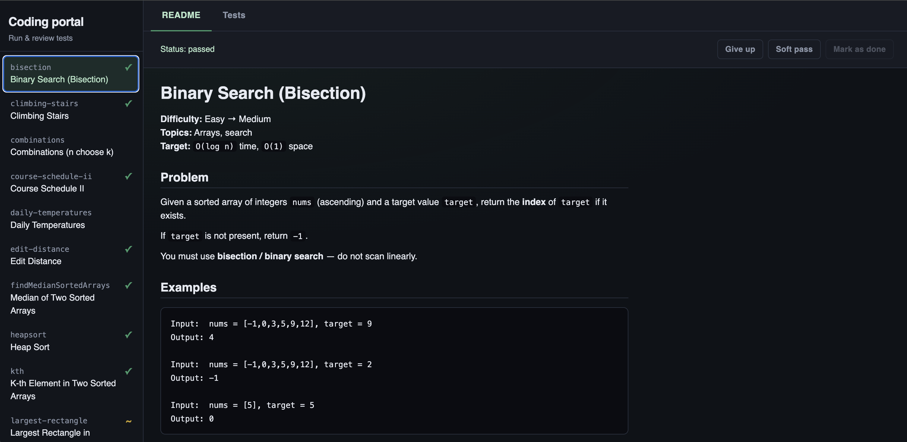
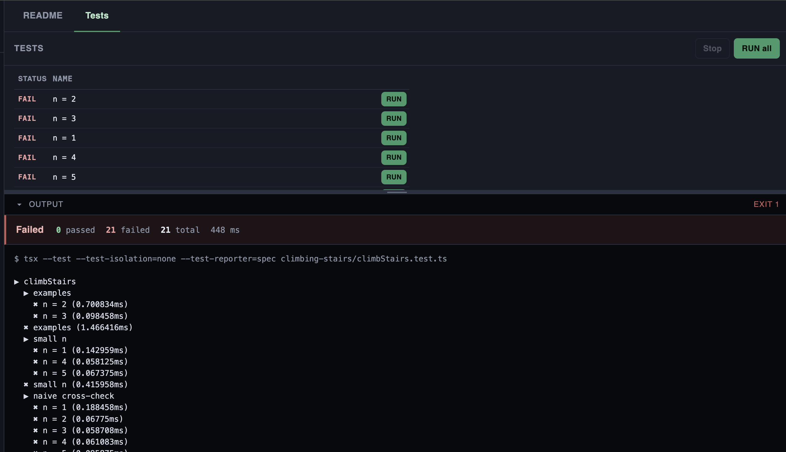

# Coding Portal

Local TypeScript workspace for algorithm / interview practice. Each exercise lives in its own folder with a statement, tests, optional hints, and a stub to implement. A small web UI lists problems and runs the test suite.

## Setup

```bash
npm install
```

Requires Node.js (with `tsx` via the project deps).

## Portal

```bash
npm run portal
```

That starts two processes:

- **UI (Vite):** [http://localhost:5173](http://localhost:5173) — open this in the browser
- **API:** [http://localhost:3456](http://localhost:3456) — test runner / progress; Vite proxies `/api` here

In API-only mode the backend does not serve the UI (so `:3456` is not the app). After `npm run portal:build`, you can run the API without `PORTAL_API_ONLY` to serve the built UI from `portal/dist` on `:3456`.





Each problem starts behind a **Start timer** gate (title + difficulty). While solving, a small clock icon shows that the timer is running; open it for elapsed time, pause/resume, or reset. Finish an attempt with **Give up**, **Soft pass**, or **Mark as done** (done needs a green full suite). That archives the impl under `<problem-id>/solutions/` (with elapsed time in a `@coding-portal-meta` comment), stops the timer, and restores the stub.

## Solve a problem

1. Open the stub (e.g. `stair-climbing-ways/stairClimbingWays.ts`) — implement there.
2. Read `PROBLEM.md` in that folder (also shown in the portal).
3. Run tests from the portal or the CLI:

```bash
npm run test:stair-climbing-ways
# or
npm run test:run -- stair-climbing-ways/stairClimbingWays.test.ts
```

`HINTS.md` and archives under `<problem-id>/solutions/` are spoilers — use only if stuck.

## Progress & solutions

Local only (gitignored) — a fresh clone starts with no statuses or archives:

- `progress.json` — latest status per problem (`pass` | `softpass` | `fail`)
- `<problem-id>/solutions/` — timestamped archives of each finished attempt

## Problem layout

```
<problem-id>/
  PROBLEM.md       # statement, examples, constraints
  HINTS.md         # spoilers
  <Name>.ts        # implement here
  .<Name>.ts       # stub template (restored when finishing an attempt)
  <Name>.test.ts   # tests
  solutions/       # local archives (gitignored)

progress.json      # local status flags (gitignored; portal creates/updates)
```

A folder is picked up by the portal when it contains `PROBLEM.md` and a `*.test.ts` file.

## CLI test scripts

| Script | Problem |
|--------|---------|
| `npm run test:bisection` | Binary search |
| `npm run test:stair-climbing-ways` | Stair climbing ways |
| `npm run test:heaviest-stretch` | Heaviest stretch |
| `npm run test:course-order` | Course order |
| `npm run test:string-conversion-cost` | String conversion cost |
| `npm run test:palindrome-keep` | Palindrome keep |
| `npm run test:median-two-sorted-sequences` | Median of two sorted sequences |
| `npm run test:heapsort` | Heap sort |
| `npm run test:kth` | K-th in two sorted arrays |
| `npm run test:histogram-max-rectangle` | Histogram max rectangle |
| `npm run test:held-water` | Held water |
| `npm run test:shortest-covering-window` | Shortest covering window |
| `npm run test:max-path-sum-in-a-tree` | Max path sum in a tree |
| `npm run test:least-recently-used-map` | Least-recently-used map |
| `npm run test:deep-copy-graph` | Deep copy a graph |
| `npm run test:connected-city-groups` | Connected city groups |
| `npm run test:shortest-path` | Shortest path (unweighted) |
| `npm run test:kth-largest-in-array` | K-th largest in an array |
| `npm run test:knapsack` | 0/1 knapsack |
| `npm run test:traveling-salesman` | Traveling salesman |
| `npm run test:knight-survival-probability` | Knight survival probability |
| `npm run test:tree-iterator` | Tree iterator (DFS / BFS) |
| `npm run test:circular-queue` | Queue |
| `npm run test:day1` / `test:day2` | Grouped suites |

## Add a new exercise

Mirror an existing folder (e.g. `stair-climbing-ways/`):

1. `PROBLEM.md` + `HINTS.md`
2. Stub `<Name>.ts` and identical hidden template `.<Name>.ts`
3. `<Name>.test.ts` importing `it` from `../test/it`
4. Optional `test:<id>` script in `package.json`
